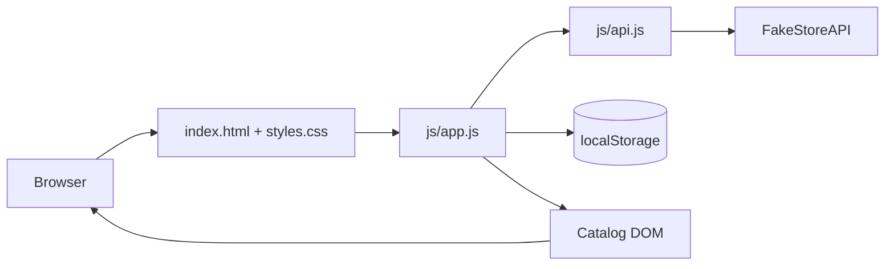

# A11y Store — Accessibility + Architecture Capstone

An accessible, responsive product-catalog capstone demonstrating semantic HTML5, modular JavaScript, public REST API integration, simulated authentication, client-side CRUD, persistent local state, responsive design, and resilient loading/error UX.

## Feature highlights
- **Simulated authentication:** sign-in/sign-out state is persisted locally; no real credentials are sent to a server.
- **Interactive catalog:** products load asynchronously from FakeStoreAPI using `fetch()` and `async/await`.
- **Search, categories and sorting:** all filtering happens in memory and updates the DOM without a full-page reload.
- **CRUD operations:** add, edit and delete products in the client-side catalog. CRUD changes persist in `localStorage`.
- **Persistent cart:** add-to-cart state survives browser refreshes.
- **Resilient UX:** loading skeletons, friendly error banner, retry action, and graceful `localStorage` failure handling.
- **Accessibility:** semantic landmarks, skip link, visible keyboard focus, labelled forms, native dialogs, captions and scoped table headers.
- **Responsive UI:** mobile-first breakpoints at 320px, 768px, 1024px and 1440px with no intentional horizontal page overflow.

## Architecture


### First vertical feature slice
```text
User
  ↓
Accessible Catalog UI
  ↓
app.js state + event handlers
  ├── api.js → public REST API
  ├── localStorage → cart/user/catalog cache
  └── DOM rendering → search/category/sort/CRUD
```

## Repository structure
```text
accessibility-architecture-audit/
├── index.html
├── styles.css
├── js/
│   ├── app.js
│   └── api.js
├── pages/
│   ├── data.html
│   └── forms.html
├── client/src/
├── server/src/
├── docs/
│   ├── audit/
│   ├── architecture.md
│   └── screenshots/
├── test/accessibility/
├── scripts/lighthouse.sh
├── vercel.json
└── README.md
```

## Setup

### Option 1 — Static local server
Because the application uses JavaScript modules, serve the directory over HTTP rather than opening `index.html` with `file://`.

```bash
cd accessibility-architecture-audit
python -m http.server 8000
```

Open `http://localhost:8000/` in a browser.

### Option 2 — Vercel
The included `vercel.json` is ready for a static Vercel deployment.

1. Import the GitHub repository into Vercel.
2. Set the project root to `accessibility-architecture-audit`.
3. Use no build command for this static project.
4. Deploy and copy the generated public URL into your final submission.

> **Deployment status:** The source repository is prepared for deployment, but this ChatGPT session does not have access to a Vercel/Netlify/Cloudflare deployment account, so a live public URL cannot be truthfully claimed here.

## Public API
The catalog reads products from FakeStoreAPI at runtime. If the API is unavailable, the app shows an accessible error banner with a retry control. Previously loaded catalog data is cached locally.

## Data persistence
The demo uses browser `localStorage` keys for:
- `a11y-products` — catalog cache and local CRUD changes
- `audit-cart` — cart items
- `a11y-user` — simulated authentication session

This is intentionally a **simulation**, not production authentication. Do not enter real passwords.

## Accessibility validation
The repository includes the earlier audit documentation and keyboard-testing guidance. Run the Lighthouse script and W3C HTML checker before claiming final validation results. The project does **not** invent a Lighthouse score or W3C zero-error result without executing those checks.

## Final evaluation checklist
- [x] GitHub source code committed
- [x] Authentication simulation
- [x] Interactive REST-powered catalog
- [x] Search/category/sort without reload
- [x] Client-side CRUD
- [x] Persistent local state
- [x] Loading and error states
- [x] Responsive accessible UI
- [x] Architecture diagram and setup instructions
- [x] Vercel deployment configuration
- [ ] Live deployment URL — deploy from Vercel/Netlify/Cloudflare Pages
- [ ] Final Lighthouse/W3C evidence — execute against the deployed site

## Repository
**GitHub:** https://github.com/Arup743290/Arup_mondal/tree/main/accessibility-architecture-audit
